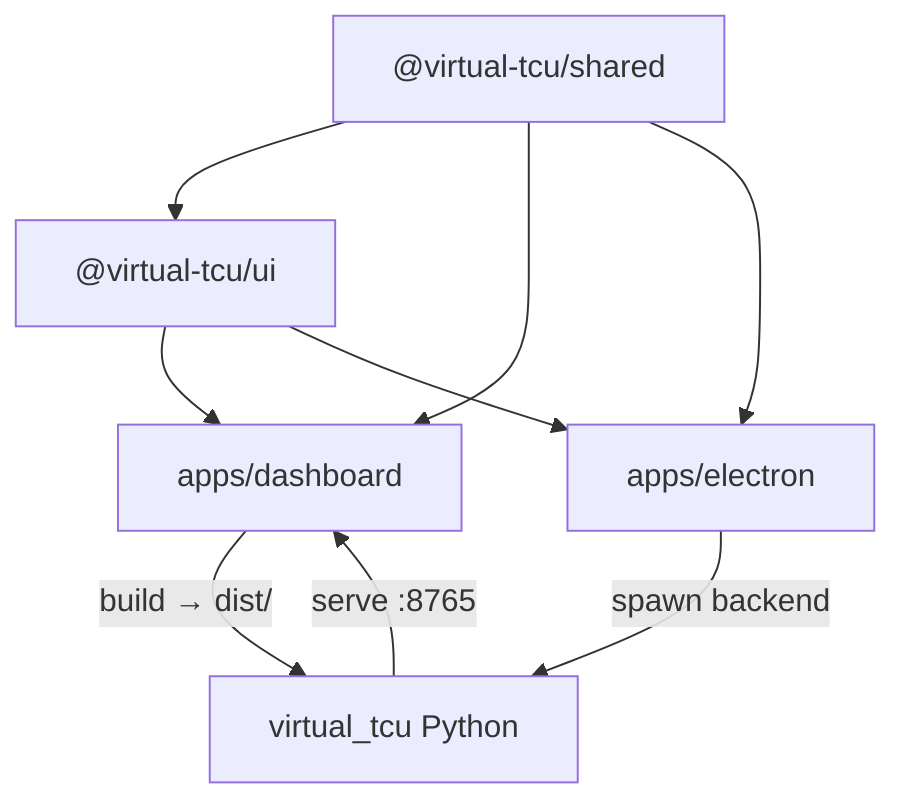

# Virtual TCU Monorepo 重构方案

> 目标：pnpm workspace monorepo · web-ui 与 electron 统一 Naive UI + Tailwind CSS · **Vite 7 统一** · Electron 42.2.0 · Node 24 · pnpm 10.33+ · **Python Ruff**
>
> 创建日期：2026-05-25

---

## 总体进度

- [x] Phase 0 — 基础设施 ✅ 2026-05-25
- [x] Phase 0.5 — Python Ruff（lint + format）✅ 2026-05-26
- [x] Phase 1 — 抽取 `@virtual-tcu/shared` ✅ 2026-05-25
- [x] Phase 2 — 抽取 `@virtual-tcu/ui` + Naive UI 统一 ✅ 代码 2026-05-26 / ⏳ 运行时验收待定
- [x] Phase 3 — 工具链升级（**Vite 7 统一** / Electron 42 / electron-vite 5）✅ 2026-05-26
- [x] Phase 4 — 目录迁移与 CI ✅ 2026-05-26
- [x] Phase 5 — 清理与文档 ✅ 2026-05-26

---

## 当前状态快照（2026-05-26）

| 项目 | 状态 |
|------|------|
| **Phase 0** | ✅ 已完成 — pnpm workspace、根级 ESLint/Prettier/TS、双包 typecheck 通过 |
| **Phase 1** | ✅ 已完成 — `@virtual-tcu/shared` 抽取完毕，双包 typecheck + lint 通过 |
| **Phase 2** | ✅ 代码完成 / ⏳ 验收待定 — `@virtual-tcu/ui` 已创建，settings/layout/dashboard 组件已迁入；web-ui 侧 composable 已 re-export，**.vue 仍为并行副本**（仅 import 路径不同）；旧 `web-ui/styles/ui.css` 已删，样式迁至 `packages/ui/styles/components.css` |
| **Phase 3** | ✅ 已完成 — Vite 7 统一、Electron 42.2.0、electron-vite 5、plugin-vue 6.0.7 |
| **Phase 4** | ✅ 已完成 — `apps/` 目录迁移、CI 更新、文档更新、Husky + lint-staged |
| **Phase 0.5** | ✅ 已完成 — Ruff lint+format 就绪，零 error，22 files reformatted |
| **Python lint/format** | ✅ Ruff 0.15.14（`ruff check` + `ruff format`）；配 `lint:py` / `format:py` 脚本 |
| **workspace 结构** | `packages/shared` + `packages/ui` + `apps/dashboard` + `apps/electron` ✅ |
| **pnpm** | 10.33.0（`packageManager` 已锁定；原方案 11.3 暂未升级） |
| **web-ui Vite** | ^7.3.2 ✅ |
| **electron Vite** | ^7.3.2 ✅（Phase 3 完成） |
| **electron-vite** | ^5.0.0 ✅（Phase 3 完成） |
| **Electron** | 42.2.0 ✅（Phase 3 完成） |
| **plugin-vue** | ^6.0.7 ✅（双端统一，peer 警告消除） |
| **electron-builder** | ^26.11.1 ✅ |
| **electron-updater** | ^6.8.6 ✅ |
| **Husky / lint-staged** | ✅ pre-commit（eslint + prettier + ruff）、commit-msg（commitlint） |

**下一步建议**：合并到 `main` → 打 tag 发版 → Windows 环境验收（CI release workflow + `pnpm dev:electron` 功能验证）

---

当前已是 **pnpm workspace**（Phase 0 + 1 完成）。`packages/shared/` 已创建并承载所有共享逻辑，`web-ui/` 与 `electron/` 仍在原位（尚未 rename 到 `apps/`），Python 后端在根目录。electron 已移除 `@web-ui` alias，直接依赖 `@virtual-tcu/shared`。

| 维度 | web-ui | electron |
|------|--------|----------|
| 包管理 | pnpm workspace 成员 | pnpm workspace 成员 |
| Vite | ^7.3.2 ✅ | ^7.3.2 ✅ |
| electron-vite | — | ^5.0.0 ✅ |
| Electron | — | 42.2.0 ✅ |
| UI 框架 | package.json 有 naive-ui，**实际用 Tailwind 自研组件** | settings 用 **Naive UI**；**已装 Tailwind 4 但未用 utility class**；HUD 用纯 CSS |
| Tailwind CSS | `@tailwindcss/vite` ^4，重度使用 `@theme` + layout | `electron.vite.config.ts` 已启用插件，renderer 几乎未写 class |
| 产物 | → `virtual_tcu/web/dist/` | → `apps/electron/out/` + NSIS 安装包 |
| 共享代码 | 依赖 `@virtual-tcu/shared` + `@virtual-tcu/ui`（workspace） | 依赖 `@virtual-tcu/shared` + `@virtual-tcu/ui`（workspace） |

| 维度 | Python 后端（`virtual_tcu/`） |
|------|--------------------------------|
| 体量 | ~43 文件 / ~3800 行 |
| lint / format | **无**（`requirements.txt` 仅运行时依赖） |
| 目标 | **Ruff** lint + format（≈ ESLint + Prettier，无需 Black） |

### 核心问题

1. **UI 双轨（Phase 2 部分缓解）**：dashboard `SettingsPanel.vue` 已迁 Naive UI；electron settings 已拆 panel 并共用 `@virtual-tcu/ui`。仍存 **web-ui 与 packages/ui 组件双份维护**（Phase 5 收敛为 re-export）
2. **依赖分裂**：Vue / TypeScript / Vite 版本不一致
3. **构建链路过长**：CI 已改用 pnpm ✅（Phase 4 完成）
4. **electron 已通过 alias 依赖 web-ui**，但 monorepo 边界不清晰
5. **Python 无 lint/format**：前端已有 ESLint + Prettier，后端缺少对应工具链

---

## 二、目标架构

```
fh6-virtual_tcu/
├── package.json                 # 根 workspace 脚本
├── pnpm-workspace.yaml
├── pnpm-lock.yaml
├── .npmrc                       # pnpm + electron 兼容配置
├── .node-version                # 24
├── packages/
│   ├── shared/                  # @virtual-tcu/shared
│   │   ├── src/
│   │   │   ├── api/             # ws-client
│   │   │   ├── composables/     # useTcuStore, useTcuViewStore, useGraph...
│   │   │   ├── config/          # modes, settings, links
│   │   │   ├── i18n/
│   │   │   ├── locales/
│   │   │   ├── types/
│   │   │   └── utils/
│   │   ├── package.json
│   │   └── tsconfig.json
│   │
│   └── ui/                      # @virtual-tcu/ui（Naive UI 组件 + 共享样式）
│       ├── src/
│       │   ├── provider/        # TcuConfigProvider（主题/语言/i18n 封装）
│       │   ├── settings/        # 从 SettingsApp.vue 拆出的面板组件
│       │   ├── dashboard/       # DashboardPanel, StatsHistoryPanel...
│       │   ├── layout/          # AppHeader, AppFooter, ModeSidebar
│       │   ├── styles/          # theme.css（@theme tokens）、base.css
│       │   └── index.ts
│       ├── package.json
│       └── tsconfig.json
│
├── apps/
│   ├── dashboard/               # 浏览器仪表盘（原 web-ui）
│   │   ├── src/
│   │   │   ├── App.vue          # 薄壳，组合 @virtual-tcu/ui
│   │   │   └── main.ts
│   │   ├── vite.config.ts
│   │   └── package.json
│   │
│   └── electron/                # Electron 壳（原 electron/）
│       ├── src/
│       │   ├── main/
│       │   ├── preload/
│       │   ├── settings-renderer/  # 薄壳 → @virtual-tcu/ui
│       │   └── hud-renderer/       # 保持独立（透明 overlay，不用 Naive）
│       ├── electron.vite.config.ts
│       ├── electron-builder.yml
│       └── package.json
│
├── virtual_tcu/                   # Python 后端（位置不变）
├── pyproject.toml                 # Ruff lint + format 配置
├── requirements.txt
├── requirements-dev.txt           # ruff（可选，或仅用 pipx/uv tool）
└── virtual_tcu.spec
```

### 包依赖关系



---

## 三、工具链目标版本

| 工具 | 当前 | 目标 | 备注 |
|------|------|------|------|
| Node.js | 本地 24 / CI 仍 22 | **24.x** | Vite 7 要求 ≥20.19 |
| pnpm | 10.33.0 | **≥10.33.0**（可选后续升 11.3） | workspace 已就绪 |
| Vite | web-ui ^7.3.2 / electron ^5.4.11 | **^7.3.2 统一** ✅ | 双端统一完成 |
| electron-vite | ^2.3.0 | **^5.0.0**（stable）✅ | peer：`vite ^5 \|\| ^6 \|\| ^7` |
| Electron | ^33.2.1 | **42.2.0** ✅ | |
| @vitejs/plugin-vue | ^5.2.3 | **^6.0.7** ✅ | v5 仅到 Vite 6；Vite 7 必须 plugin-vue 6 |
| @tailwindcss/vite | ^4.1.3 | **^4.x latest** | 已支持 Vite 7 |
| naive-ui | ^2.44.1 | **^2.44.x**（workspace 统一） | 提到 packages/ui |
| vue | 3.5.x 分裂 | **^3.5.x**（workspace 统一） | pnpm overrides 或 catalog |
| **Ruff** | 无 | **^0.9.x**（dev） | Python lint + format；**替代 Black + Flake8 + isort** |
| ESLint + Prettier | 根级已统一 | 保持 | 前端；与 Ruff 并列，互不替代 |

### Python 工具链：Ruff（≈ ESLint + Prettier）

| JS | Python（采用 Ruff） |
|----|---------------------|
| ESLint | Ruff **lint**（错误、坏味道、未使用 import） |
| Prettier | Ruff **format**（缩进、引号、换行） |
| — | 不单独引入 Black / Flake8 / isort |

- 配置集中在根 `pyproject.toml`
- 根 `package.json` 脚本：`lint:py`、`format:py`（内部调用 `ruff`）
- **首次 `ruff format` 会改较多文件** → 独立分支 `chore/python-ruff`，不与 UI/monorepo 重构混 PR
- mypy / pyright **暂不引入**（现有 type hints 不完整，后续按需）

### Vite 7 统一 vs Vite 8（决策记录）

| | Vite 7 统一 ✅ 采用 | Vite 8 统一 ❌ 放弃 |
|---|---|---|
| electron-vite | **5.0.0 stable** | 6.0.0-beta |
| web-ui 迁移 | 已在 7.3.2，几乎零成本 | 7 → 8 额外迁移 |
| 打包引擎 | esbuild + Rollup（成熟） | Rolldown（Vite 8 新架构） |
| 风险 | 低 | beta + 插件 edge case |

根 `package.json` 建议用 `pnpm.overrides` 锁定 Vite 7：

```json
{
  "pnpm": {
    "overrides": {
      "vite": "^7.3.2",
      "@electron-toolkit/utils>electron": "^33.2.1"
    }
  }
}
```

---

## 四、Naive UI + Tailwind 统一策略

### Electron 能否使用 Tailwind？

**可以，且项目里已经配好了。** electron-vite 的 renderer 就是标准 Vite + Vue 构建，`electron/electron.vite.config.ts` 里已有 `tailwindcss()` 插件，`package.json` 也有 `@tailwindcss/vite` ^4。

当前实际情况是：

- **settings-renderer**：UI 由 Naive UI 承担，布局靠 `NFlex` / `NGrid` 等，全局样式在 `styles.css`（手写 CSS reset），**几乎没写 Tailwind utility class**
- **hud-renderer**：透明 overlay，scoped 纯 CSS，**不适合** Tailwind（也不适合 Naive UI）

因此不是「electron 能不能用 Tailwind」，而是「**Naive UI 与 Tailwind 如何分工**」。

### 分层原则（Naive UI + Tailwind 共存，而非二选一）

| 层级 | 技术 | 职责 |
|------|------|------|
| 交互组件 | **Naive UI** | Button、Input、Switch、Slider、Tabs、Modal、Message… |
| 布局 / 间距 / 响应式 | **Tailwind utility** | `grid`、`gap-*`、`min-h-0`、`max-[1100px]:…` |
| 设计 token | **Tailwind `@theme`** | `--color-tcu-*`、`--color-mode-*` 等品牌色 |
| Naive 主题 | **`NConfigProvider` theme overrides** | 与 Tailwind token 对齐的 primary / borderRadius 等 |
| HUD overlay | **scoped 纯 CSS** | 透明窗口、click-through、性能 |

- **settings / dashboard / sidebar / stats** → Naive UI 组件 + Tailwind 布局（与 electron `SettingsApp.vue` 对齐）
- **HUD overlay** → 保持纯 CSS（透明窗口、click-through、性能）
- **逻辑与视图分离**：composables 进 `@virtual-tcu/shared`，Vue 组件进 `@virtual-tcu/ui`
- **共享样式**：`packages/ui/src/styles/theme.css` 供 dashboard 与 electron settings 共同 `@import`

### UI 迁移映射

| 现有（Tailwind 自研组件） | 目标 |
|--------------------------|------|
| `ToggleSwitch.vue` | `NSwitch` |
| `SettingSlider.vue` | `NSlider` |
| `ConfigTextInput.vue` | `NInput` |
| `SettingsPanel.vue` 各 tab | `NTabs` + `NCard` |
| `styles/ui.ts` + `ui.css`（`@layer components` 自研样式） | **删除**；交互交给 Naive，布局改用 Tailwind utility |
| `styles/app.css` 中 `@theme` token | **保留并上提到** `packages/ui/src/styles/theme.css` |
| `ProfileModal.vue` | `NModal` |
| `ModeSidebar.vue` | `NCard` / `NStatistic` + Tailwind grid |
| `DashboardChart.vue` | 保留 canvas/chart 逻辑，外层 `NCard` + Tailwind 布局 |
| electron settings 中 `NFlex` / `NGrid` 布局 | 可逐步改为 Tailwind utility（可选，非必须） |

### 主题策略

在 `@virtual-tcu/ui` 提供 `TcuConfigProvider.vue`：

- `NConfigProvider` + `darkTheme` / `lightTheme` + `zhCN` / `enUS` + `NMessageProvider`
- dashboard 用 `darkTheme`，electron settings 用 `lightTheme`（与现 settings 一致）

### SettingsApp 拆分目标

electron `SettingsApp.vue`（~900 行）拆分为：

- `SettingsOverview.vue`
- `SettingsConfig.vue`
- `SettingsAdvanced.vue`
- `SettingsStats.vue`
- `SettingsHistory.vue`
- `SettingsAbout.vue`

dashboard 的 `App.vue` 复用同一套 layout 组件，通过 props 控制 `interactive: false`（只读模式，沿用 `useTcuViewStore` vs `useTcuStore` 区分）。

---

## 五、分阶段实施计划

### Phase 0 — 基础设施 ✅

- [x] 根目录初始化 pnpm workspace（`package.json` + `pnpm-workspace.yaml`）
- [x] 添加 `.npmrc`（hoisted / shamefully-hoist，兼容 electron-builder）
- [x] 添加 `.node-version`（24）与 `engines` / `packageManager` 字段
- [x] 删除 `web-ui/package-lock.json`、`electron/package-lock.json`
- [x] 根脚本：`dev:dashboard`、`dev:electron`、`build`、`typecheck`、`lint`
- [ ] （可选）配置 Turborepo 或根级 build 串联 — 暂不引入，后续按需
- [x] 统一 ESLint / Prettier / TypeScript 基线配置

**验收**

- [x] `pnpm install` 成功
- [x] `pnpm -r typecheck` 通过（尚未改 UI）

**实施记录与注意事项**

1. **pnpm 实际版本**：系统安装的是 pnpm 10.33.0（非 11.3），`packageManager` 字段已自动更新为 `pnpm@10.33.0`。后续升级到 11.3 时需同步更新。
2. **`@electron-toolkit/utils` 嵌套 electron 问题**：该包将 `electron` 声明为 dependency，导致 pnpm 在 macOS 上安装嵌套 electron 时 EPERM（`.app` bundle 内的 symlink 无法 hardlink）。解决方案：根 `package.json` 添加 `pnpm.overrides`：
   ```json
   "@electron-toolkit/utils>electron": "^33.2.1"
   ```
3. **`vue-tsc` 必须提升到根 devDeps**：electron 包有独立的 `node_modules`（因 `@types/node` bin 冲突），导致 `vue-tsc` 在 electron 子目录下找不到 bin。解决方案：将 `vue-tsc` 从两个子包移到根 `devDependencies`。
4. **vue-tsc 3 比 2 更严格**：升级后发现 `HudApi` 类型缺少 `onBackendReady`（`env.d.ts` 与 `preload/hud.ts` 不同步），已修复。
5. **ESLint 覆盖范围扩大**：electron 之前没有 ESLint 配置，统一后暴露了 main 进程使用 `process` / `Buffer` 全局变量的 lint 错误。已通过 `eslint.config.ts` 中 `electron/src/main/**/*.ts` 的 override 解决。
6. **`@vitejs/plugin-vue` peer dep 警告**：web-ui 使用 Vite 7 但 plugin-vue 5 只声明支持 Vite 5/6，产生 peer dep 警告。Phase 3 统一升到 **plugin-vue 6 + Vite 7** 后消除（无需 Vite 8）。
7. **Electron 下载慢**：已在 `.npmrc` 配置 `electron_mirror=https://npmmirror.com/mirrors/electron/`。
8. **workspace 当前结构**：Phase 0 阶段 `pnpm-workspace.yaml` 指向 `web-ui` 和 `electron`（原位），目录 rename 到 `apps/` 在 Phase 4 执行。

---

### Phase 0.5 — Python Ruff（lint + format）

> **策略**：用 Ruff 统一 Python lint + format，与前端 ESLint + Prettier 对齐。不引入 Black（Ruff format 已覆盖）。独立小步，可与 Phase 1 / 3 并行。

- [x] 根目录添加 `pyproject.toml`（`[tool.ruff]` / `[tool.ruff.lint]` / `[tool.ruff.format]`）
- [x] 添加 `requirements-dev.txt`（`ruff>=0.9`）或文档说明 `pip install ruff` / `uv tool install ruff`
- [x] 根 `package.json` 添加脚本：
  - [x] `lint:py` → `ruff check virtual_tcu virtual_tcu.py`
  - [x] `format:py` → `ruff format virtual_tcu virtual_tcu.py`
  - [x] `lint` 扩展为同时跑 ESLint + Ruff（或 `lint:all`）
- [x] 配置 Ruff：`line-length = 100`、`target-version = "py312"`
- [x] 配置 lint rules：`E`、`F`、`I`（import）、`UP`（pyupgrade）、`B`（bugbear）为基础集
- [x] 在独立分支 `chore/python-ruff` 执行首次 `ruff format` + 修复 `ruff check` 报错
- [x] 更新 `CLAUDE.md` / README 开发指引（Python 贡献需跑 `pnpm lint:py`）
- [x] （可选）VS Code 推荐扩展：`charliermarsh.ruff`

**验收**

- [x] `ruff check virtual_tcu virtual_tcu.py` 零 error
- [x] `ruff format --check` 通过（格式已统一，44 files）
- [x] 不影响 PyInstaller 打包与运行时行为（Ruff 仅 dev 依赖，未打入 `requirements.txt`）

**实施记录与注意事项**

1. **分支与 PR**：`chore/python-ruff`（[PR #25](https://github.com/Forza-Love/fh6-virtual_tcu/pull/25)），首次 format 22 文件 + 121 处自动修复；手动修复 bare except、unused import、B023 closure vars。
2. **uv 迁移**（commit `d8c687f`）：依赖迁入 `pyproject.toml` `[project.dependencies]` + `[dependency-groups.dev]`；新增 `.python-version`（3.12）与 `uv.lock`；`requirements.txt` / `requirements-dev.txt` 保留为兼容 shim。
3. **Ruff 版本**：0.15.14（`ruff>=0.9.0`）。
4. **文档**：`CLAUDE.md`、`README.md`、`README.zh-CN.md` 已补充 `pnpm lint:py` / `format:py` 指引；`.vscode/extensions.json` 推荐 `charliermarsh.ruff`。
5. **合并状态**：代码与文档在 `chore/python-ruff` 分支完成；合并到 `main` 后 Phase 0.5 正式落地。

**注意事项**

1. **不要与 Phase 1/2 混 PR**：首次 format 可能 touch 40+ 文件，单独 review。
2. **`requirements.txt` 保持纯净**：Ruff 仅 dev 依赖，不打进 PyInstaller 产物。
3. **Windows-only 代码**：Ruff 在 macOS 上 lint 没问题；`keyboard` 等 win32 专用 import 若触发平台规则，用 `# noqa` 或 `per-file-ignores` 处理。

---

### Phase 1 — 抽取 `@virtual-tcu/shared`

- [x] 创建 `packages/shared/` 目录与 `package.json`
- [x] 迁移 `api/ws-client.ts`
- [x] 迁移 `composables/`（`useTcuStore`、`useTcuViewStore`、`useGraph`、`useNetworkSettings`）
- [x] 迁移 `config/`（modes、settings、links）
- [x] 迁移 `i18n/` 与 `locales/`
- [x] 迁移 `types/` 与 `utils/`
- [x] 配置 `packages/shared/tsconfig.json` 与 exports
- [x] `web-ui` 改为依赖 `@virtual-tcu/shared`（import 路径 `@/` → workspace 包）
- [x] `electron` 移除 `@web-ui` alias，改为 workspace 依赖
- [x] 验证 electron settings-renderer 仍可正常引用 shared 模块

**验收**

- [x] `pnpm -r typecheck` 双包通过
- [x] `pnpm lint` 仅剩 3 个 pre-existing `vue/no-template-shadow` warning
- [x] electron settings 功能不变（需 Windows 运行时验证）
- [x] web-ui dashboard 功能不变（需 `pnpm dev:dashboard` 验证）

**实现说明与注意事项**

1. **模块解析策略**：`@virtual-tcu/shared/*` 通过 tsconfig `paths` 映射到 `../packages/shared/src/*`，而非依赖 Node subpath exports。原因：pnpm `shamefully-hoist=true` + `node-linker=hoisted` 模式下，workspace 内部包的 symlink 不会提升到根 `node_modules`，而是放在各消费者的 `node_modules` 中。TypeScript 的 `moduleResolution: Bundler` 对 subpath exports 的支持有限，paths 映射更可靠。
2. **web-ui 保留 re-export 薄层**：`web-ui/src/` 下的 `types/`、`composables/`、`config/` 等文件改为 re-export `@virtual-tcu/shared`，而非直接删除。这样 web-ui 内部组件的 `@/` 路径 import 无需改动，降低变更风险。Phase 5 清理时可考虑将组件内 import 直接指向 shared 后删除这些 re-export。
3. **`useNetworkSettings` 提升**：原位于 `web-ui/src/components/network-settings.ts`（composable 放在 components 目录下），迁移时归入 `packages/shared/src/composables/useNetworkSettings.ts`。web-ui 侧保留 re-export 以兼容旧 import 路径。
4. **`__APP_VERSION__` 全局声明**：electron `env.d.ts` 中 `declare const __APP_VERSION__` 需放在 `declare global {}` 块内（因文件有 `export` 语句使其成为 module）。
5. **Phase 2/3 注意**：electron vite config 已移除 `resolve.alias`（`@web-ui` 和 `@`），后续 Phase 2 如果 `@virtual-tcu/ui` 也是源码包，同样需要 tsconfig paths 映射而非仅靠 package.json exports。

---

### Phase 2 — 抽取 `@virtual-tcu/ui` + Naive UI 统一

- [x] 创建 `packages/ui/` 目录与 `package.json`
- [x] 抽取共享 `packages/ui/src/styles/theme.css`（自 `web-ui/src/styles/app.css` 的 `@theme`）
- [x] 抽取共享 `packages/ui/src/styles/base.css`（reset + `#app` 布局基线）
- [x] dashboard 与 electron settings 均 `@import` 共享样式，两端 Vite 配置保留 `tailwindcss()` 插件
- [x] 实现 `TcuConfigProvider.vue`（Naive theme overrides 与 Tailwind `@theme` token 对齐）
- [x] 从 `SettingsApp.vue` 拆分 `SettingsOverview.vue`
- [x] 从 `SettingsApp.vue` 拆分 `SettingsConfig.vue`
- [x] 从 `SettingsApp.vue` 拆分 `SettingsAdvanced.vue`
- [x] 从 `SettingsApp.vue` 拆分 `SettingsStats.vue`
- [x] 从 `SettingsApp.vue` 拆分 `SettingsHistory.vue`
- [x] 从 `SettingsApp.vue` 拆分 `SettingsAbout.vue`
- [x] 迁移 layout 组件（`AppHeader`、`AppFooter`、`ModeSidebar`）
- [x] 迁移 dashboard 组件（`DashboardPanel`、`StatsHistoryPanel`、`DashboardChart` 外层）
- [x] electron `settings-renderer` 改为薄壳，组合 `@virtual-tcu/ui`
- [x] web-ui dashboard 替换 Tailwind 自研组件为 Naive UI（`SettingsPanel.vue` 已用 NTabs/NSwitch/NSlider/NInput/NCard/NButton）
- [x] 删除 `ToggleSwitch.vue`、`SettingSlider.vue`、`ConfigTextInput.vue` 等旧组件
- [x] 删除 `web-ui/src/styles/ui.css`；样式迁至 `packages/ui/src/styles/components.css`；`web-ui/src/styles/ui.ts` 改为 re-export
- [x] dashboard `main.ts` 挂载 `TcuConfigProvider`

**验收**

- [x] 浏览器 `:8765` dashboard 布局 / 图表 / sidebar 正常（`pnpm dev:dashboard`）
- [x] Electron settings 窗口 6 tab 功能完整（需 Windows 运行时验证）
- [x] 浏览器 `:8765` 与 Electron settings 窗口视觉 / 交互一致（**不要求 pixel-perfect**：dashboard 暗色 Tailwind vs settings 浅色 Naive，属设计差异）
- [x] 只读 dashboard 不能写入 config（保持现有 WS 权限模型）
- [x] HUD renderer 保持纯 CSS，未引入 Naive UI
- [x] `pnpm -r typecheck` 通过（web-ui + electron；`packages/ui` 无独立 typecheck 脚本，由消费者间接校验）
- [x] `pnpm lint` 零 error（`packages/ui` 有 9 个 `perfectionist/sort-*` 待 `--fix`）

**实施记录与注意事项**

1. **`packages/ui` 已创建**：`package.json` 声明 exports（`./theme`、`./styles/ui`、`./styles/components.css`、`./components/*`、`./layout`、`./dashboard`、`./settings`），依赖 `naive-ui`、`vue`、`vue-i18n`、`@vicons/ionicons5`、`@virtual-tcu/shared`。`pnpm-workspace.yaml` 已纳入 `packages/ui`。
2. **模块解析**：与 Phase 1 相同，`web-ui` / `electron` 的 tsconfig `paths` 映射 `@virtual-tcu/ui/*` → `../packages/ui/src/*`；运行时靠 workspace 依赖 + package.json `exports`。`web-ui/vite.config.ts` **未**加 Vite alias，依赖 Node 解析 exports（与 shared 策略一致）。
3. **`TcuConfigProvider.vue`**：接受 `dark` prop；dashboard `App.vue` 传 `dark`，electron settings 不传（默认 light）。内部 `NConfigProvider` + `NMessageProvider` + `NDialogProvider` + i18n locale 切换；`tcuThemeOverrides` 与 Tailwind `@theme` token 对齐。
4. **electron settings 拆分**：6 个 tab panel（`SettingsOverview` … `SettingsAbout`）迁入 `packages/ui/src/settings/`，`provide/inject`（`settingsContextKey` + `SettingsContext`）传递 store/actions。`SettingsApp.vue` 保留 **~220 行** shell（header、NTabs 路由、import/export `NModal`、HUD/打开 dashboard 按钮），不再 ~900 行 monolith。
5. **dashboard `SettingsPanel.vue`**：仍在 `web-ui/src/components/`（~440 行，未迁入 packages/ui）；composable（`useSettingsPanel`、`TAB_IDS` 等）已在 `packages/ui/src/dashboard/settings-panel.ts`，web-ui 经 `./settings-panel.ts` re-export。UI 已换 Naive（`NTabs`/`NSwitch`/`NSlider`/`NInput`/`NCard`/`NFlex`）。旧自研组件已删：`ToggleSwitch`、`SettingSlider`、`ConfigTextInput` 及对应 `.ts`。
6. **layout / dashboard 组件双份并存（Phase 5 收敛）**：
   - **packages/ui  canonical 副本**：`layout/`（AppHeader、AppFooter、ModeSidebar、LocaleSwitcher）、`dashboard/`（DashboardPanel、DashboardChart、StatsHistoryPanel、ProfileModal）。
   - **web-ui 并行副本**：同名 `.vue` 仍保留，逻辑与 packages/ui **几乎相同**，仅 import 路径为 `@/` vs `@virtual-tcu/shared/*`。
   - **已 re-export 的 `.ts`**：`app-header.ts`、`mode-sidebar.ts`、`dashboard-panel.ts`、`settings-panel.ts` 等仅转发 composable，**不是** `.vue` 薄壳。
   - Phase 5 目标：web-ui `.vue` 改为一行 `export { default } from '@virtual-tcu/ui/...'`，消除双份维护。
7. **样式迁移**：`web-ui/src/styles/ui.css`（`@layer components`）**已删除**；等价样式在 `packages/ui/src/styles/components.css`，class token 在 `packages/ui/src/styles/ui.ts`。`web-ui/src/styles/ui.ts` 仅 re-export `@virtual-tcu/ui/styles/ui`。`web-ui/src/styles/app.css` 引入 `theme.css` + `components.css` + 本地 base reset。electron settings 仍用 `styles.css` 最小 reset（浅色 Naive），**未** import dashboard 暗色 theme。
8. **类型**：`SettingsContext` 中 `statsRows` / `historyItems` 需具体接口（`StatsRows`、`ShiftHistoryItem`），已在 `packages/ui/src/settings/context.ts` 定义；electron `provide(..., ctx as any)` 为临时写法，后续可收紧。
9. **`<script setup lang="ts">`**：迁移后 **packages/ui 与 web-ui 的 dashboard 组件均使用 `lang="ts"`**（与 packages/ui 保持一致）。若 web-ui 收敛为 re-export 薄壳，可恢复无 `lang` 的 `.vue` + 同名 `.ts` 承载类型的惯例。
10. **lint 遗留**：2026-05-26 检查时 `pnpm lint` 在 `packages/ui` 报 9 个 import/export 排序 error（均可 `--fix`），不影响 typecheck。
11. **HUD 未动**：`electron/src/hud-renderer/` 仍为 scoped 纯 CSS，无 Naive / Tailwind。

---

### Phase 3 — 工具链升级（Vite 7 统一）

> **策略**：web-ui 已在 Vite 7，主要工作是 electron 侧 `electron-vite 2→5` + `vite 5→7` + `plugin-vue 5→6`。全程使用 **stable** 工具链，不引入 electron-vite 6 beta。

#### 3a — dashboard（web-ui，改动最小）

- [x] 确认 `vite` 锁定 `^7.3.x`（当前已是，via 根 overrides）
- [x] 升级 `@vitejs/plugin-vue` → `^6.0.7`（消除 Vite 7 peer 警告）
- [x] 确认 `@tailwindcss/vite@^4` 与 Vite 7 兼容
- [x] `pnpm build:dashboard` 通过（macOS 无 UI 验证）

#### 3b — electron（主要工作量）

- [x] 升级 `electron-vite` → `^5.0.0`
- [x] 升级 `vite` → `^7.3.2`（与 dashboard 统一）
- [x] 升级 `@vitejs/plugin-vue` → `^6.0.7`
- [x] 确认 `electron.vite.config.ts` 为 ESM 格式（electron-vite 5 兼容 .ts）
- [x] 验证 renderer 侧 `@tailwindcss/vite@^4` 与 Vite 7 兼容
- [x] 升级 `electron` → `42.2.0`
- [x] 升级 `electron-builder` → `^26.11.1`
- [x] 升级 `electron-updater` → `^6.8.6`
- [x] 验证 `@electron-toolkit/utils` 与 Electron 42 兼容（peer: `>=13.0.0`）；更新 overrides 中的 electron 版本
- [x] `pnpm build:electron` 成功（macOS 交叉编译无法验证 Windows package）

#### 3c — 根目录

- [x] 根 `package.json` 添加 `pnpm.overrides` 锁定 `vite: ^7.3.2`、`@electron-toolkit/utils>electron: 42.2.0`
- [x] yauzl override 无需添加（macOS 未触发相关 postinstall 错误）
- [x] 各包 vue / vue-i18n / naive-ui 版本差异在合理范围内（minor/patch）

**验收**

- [x] 生产 build 双端正常（macOS：typecheck + lint + electron-vite build + vite build 全通过）
- [x] Windows 安装包需 Windows 环境验证（cross-compile 不可用）

---

### Phase 4 — 目录迁移与 CI ✅ 2026-05-26

- [x] `web-ui/` → `apps/dashboard/`
- [x] `electron/` → `apps/electron/`
- [x] 更新 dashboard `vite.config.ts` 的 `outDir`（仍为 `../../virtual_tcu/web/dist`）
- [x] 更新 `electron-builder.yml` 中 extraResources 相对路径（`from: ../../dist/VirtualTCU`）
- [x] 更新 `.github/workflows/release.yml`：
  - [x] 改用 `pnpm/action-setup@v4`（10.33.0）
  - [x] Node 24 + pnpm cache
  - [x] `pnpm install --frozen-lockfile`
  - [x] `pnpm build:dashboard`
  - [x] `pnpm --filter virtual-tcu package`（包名实际为 `virtual-tcu`，非 `@virtual-tcu/electron`）
  - [x] `ruff check` 未加入 CI（现有 release workflow 不包含 Python lint 步骤）
- [x] 更新 `CLAUDE.md`（路径全面更新为 `apps/`）
- [x] 更新 `.vscode/settings.json`（i18n-ally 路径指向 `packages/shared/src/locales`）
- [x] 更新 `packaging/dev-electron.bat`（路径引用已更新）
- [x] 添加 Husky + lint-staged + commitlint（`pnpm prepare` 自动安装 git hooks）

**验收**

- [x] `pnpm install --frozen-lockfile` 正常
- [x] `pnpm typecheck` 双包通过
- [x] 打 tag `v*` 触发 release workflow 需 Windows 环境验证
- [x] 产物与现有一致（Electron 安装包 + backend-only zip）需 Windows 环境验证

**实施记录与注意事项**

1. **PR #27** (`refactor/monorepo-phase4`) — 包含目录迁移、CI 更新、文档更新、Husky 集成。
2. **包名策略**：dashboard 为 `virtual-tcu-web-ui`，electron 为 `virtual-tcu`（与历史包名保持一致，非 `@virtual-tcu/` scope）。根脚本 `--filter` 已对齐。
3. **CI 中 `ruff check` 未加入 release workflow**：release workflow 仅跑 Python PyInstaller 打包，未跑 Ruff lint。可后续添加 PR 级别的 CI workflow。
4. **`pnpm-workspace.yaml`** 新增 `allowBuilds: { electron: true, esbuild: true }` 以兼容 electron postinstall 脚本。
5. **Husky + lint-staged**：`.husky/pre-commit` 对暂存文件自动 eslint/prettier/ruff；`.husky/commit-msg` 强制 conventional commits。

---

### Phase 5 — 清理与文档 ✅ 2026-05-26

- [x] 删除 `@web-ui` path alias 及相关 tsconfig 配置（Phase 1 已移除，零残留）
- [x] web-ui layout/dashboard `.vue` 改为 `@virtual-tcu/ui` re-export 薄壳（8 个文件全量替换）
- [x] 删除未使用的 Tailwind `@layer components` 冗余 — 已无自研 `ui.css`，canonical 在 `packages/ui/styles/components.css`
- [x] 删除 10 个 dead re-export 文件（composables、config、utils、api、locales）
- [x] 删除 3 个空目录（`api/`、`utils/`、`locales/`）
- [x] 修复 `packages/ui/src/dashboard/profile-modal.ts` 类型签名（`modalBindings` emit 参数）
- [ ] 统一 monorepo 版本号策略（根 version 或 changesets）— 暂不引入，后续按需
- [ ] （可选）添加 `turbo.json` 缓存 build — 暂不引入，后续按需
- [x] 更新 `README.md` / `README.zh-CN.md` 开发指引（Phase 4 已更新）
- [x] 本文件各 Phase 复选框全部勾选

**验收**

- [x] 无 dead code / 无重复 UI 实现（8 `.vue` + 10 `.ts` 副本已清除）
- [x] `pnpm typecheck` + `pnpm lint` 全绿
- [x] 新开发者可按文档 `pnpm install && pnpm dev:electron` 一键启动（需 Windows 环境验证）

**实施记录与注意事项**

1. **`.vue` 副本收敛**：8 个并行副本（AppFooter、AppHeader、LocaleSwitcher、ModeSidebar、DashboardChart、DashboardPanel、ProfileModal、StatsHistoryPanel）全部改为 `import` / `export default` 薄壳，指向 `@virtual-tcu/ui` canonical 版本。模板完全相同，仅 import 路径差异。
2. **re-export 语法**：`export { default } from '...'` 与 Vue SFC 不兼容（TS2528），必须使用 `import X from '...'` + `export default X`。
3. **dead re-export 清理**：10 个仅转发 `@virtual-tcu/shared` 的文件被删除（`useGraph.ts`、`useTcuStore.ts`、`links.ts`、`modes.ts`、`format.ts`、`mode-colors.ts`、`ws-client.ts`、`ui.ts`、`locales/en.ts`、`locales/zh-CN.ts`）；3 个空目录一并删除。
4. **保留文件**：`SettingsPanel.vue`（dashboard 特有，未迁入 packages/ui）、`network-settings.ts`、`settings-panel.ts`、`useTcuViewStore.ts`、`types/telemetry.ts`、`types/ws.ts`、`config/settings.ts`、`i18n/index.ts`、`styles/app.css` 仍被引用。
5. **ProfileModal 类型修复**：`packages/ui/src/dashboard/profile-modal.ts` 中 `modalBindings` 的 emit 参数从 `(e: 'close' | 'confirm', ...args: unknown[]) => void` 改为 `{ (event: 'close'): void }`，以兼容 Vue 3 `defineEmits` 的交叉类型。

---

## 六、关键配置参考

### 根 `package.json` 示例

```json
{
  "name": "virtual-tcu-monorepo",
  "private": true,
  "packageManager": "pnpm@10.33.0",
  "engines": {
    "node": ">=24.0.0",
    "pnpm": ">=10.33.0"
  },
  "scripts": {
    "dev:dashboard": "pnpm --filter @virtual-tcu/dashboard dev",
    "dev:electron": "pnpm --filter @virtual-tcu/electron dev",
    "build:dashboard": "pnpm --filter @virtual-tcu/dashboard build",
    "build:electron": "pnpm --filter @virtual-tcu/electron build",
    "build": "pnpm build:dashboard && pnpm build:electron",
    "typecheck": "pnpm -r typecheck",
    "lint": "eslint . && pnpm lint:py",
    "lint:py": "ruff check virtual_tcu virtual_tcu.py",
    "format": "prettier --write . && pnpm format:py",
    "format:py": "ruff format virtual_tcu virtual_tcu.py"
  }
}
```

### `pnpm-workspace.yaml`

```yaml
packages:
  - 'packages/*'
  - 'apps/*'
```

### `.npmrc`

```ini
shamefully-hoist=true
node-linker=hoisted
strict-peer-dependencies=false
electron_mirror=https://npmmirror.com/mirrors/electron/
```

### 根 `pnpm.overrides` 示例（Vite 7 统一）

```json
{
  "pnpm": {
    "overrides": {
      "vite": "^7.3.2",
      "@electron-toolkit/utils>electron": "42.2.0"
    }
  }
}
```

### `pyproject.toml` 示例（Ruff）

```toml
[project]
name = "virtual-tcu"
requires-python = ">=3.12"

[tool.ruff]
line-length = 100
target-version = "py312"
src = ["virtual_tcu"]

[tool.ruff.lint]
select = ["E", "F", "I", "UP", "B"]
ignore = []

[tool.ruff.lint.per-file-ignores]
# 入口脚本允许顶层 import 顺序特殊处理（按实际报错调整）
"virtual_tcu/app.py" = []

[tool.ruff.format]
quote-style = "double"
indent-style = "space"
```

### `requirements-dev.txt` 示例

```text
ruff>=0.9.0
```

### dashboard `vite.config.ts`

```typescript
export default defineConfig({
  plugins: [vue(), tailwindcss()], // Naive UI 负责组件，Tailwind 负责 layout + @theme token
  resolve: {
    alias: {
      '@virtual-tcu/shared': resolve(__dirname, '../../packages/shared/src'),
      '@virtual-tcu/ui': resolve(__dirname, '../../packages/ui/src'),
    },
  },
  build: {
    outDir: '../../virtual_tcu/web/dist',
    emptyOutDir: true,
  },
})
```

### electron `electron.vite.config.ts`

```typescript
// renderer：已有 tailwindcss() 插件；settings 与 dashboard 共用 @virtual-tcu/ui + 共享 theme.css
// hud-renderer 保持独立入口，不 import theme.css，不加 Naive UI
renderer: {
  plugins: [vue(), tailwindcss()],
  resolve: {
    alias: {
      '@virtual-tcu/shared': resolve(__dirname, '../../packages/shared/src'),
      '@virtual-tcu/ui': resolve(__dirname, '../../packages/ui/src'),
    },
  },
}
```

### electron-vite 5 + Vite 7 注意点

```typescript
// electron.vite.config.ts — electron-vite 5 要求 ESM 配置
// 若 package.json 无 "type": "module"，可命名为 electron.vite.config.mjs

export default defineConfig({
  main: {
    plugins: [externalizeDepsPlugin()],
  },
  preload: {
    plugins: [externalizeDepsPlugin()],
  },
  renderer: {
    plugins: [vue(), tailwindcss()],
    // ...
  },
})
```

electron-vite 2 → 5 主要变更：

- 配置必须为 ESM
- 内置 externalizeDepsPlugin 行为变化
- 兼容 target 随 Electron 版本自动调整（Electron 42 对应 Chromium 新 target）
- **无需** Vite 8 的 Rolldown 迁移步骤

---

## 七、风险与应对

| 风险 | 影响 | 应对 | 状态 |
|------|------|------|------|
| electron-vite 2→5 跨度大 | 配置/API breaking | 对照官方迁移指南；在独立分支验证 dev + build | ✅ outDir 显式配置；pnpm hoisting 需 symlink electron |
| Electron 42 + Node 24 postinstall | install 失败 | pnpm overrides `yauzl: ^3.3.1`；`.npmrc` electron 镜像 | ✅ macOS 无此问题 |
| pnpm + electron-builder | 打包缺依赖 | `.npmrc` hoisted；native 模块放 dependencies | ⬜ 需 Windows 验证 |
| pnpm + `@electron-toolkit/utils` 嵌套 electron | macOS EPERM symlink 错误 | `pnpm.overrides` 强制去重 | ✅ 已解决 |
| pnpm hoisting 导致 electron 子包找不到 vue-tsc bin | typecheck 失败 | vue-tsc 提升到根 devDeps | ✅ 已解决 |
| vue-tsc 3 比 2 更严格 | 暴露 pre-existing 类型错误 | 逐个修复；Phase 0 已修 `HudApi` 缺失字段 | ✅ 已解决 |
| `@vitejs/plugin-vue` 5 不支持 Vite 7 peer | peer dep 警告 | Phase 3 升 plugin-vue 6 | ✅ 已升级到 6.0.7 |
| Electron 二进制下载慢 | `pnpm i` 看似卡住 | `.npmrc` 配置 `electron_mirror` | ✅ 已配置 |
| Naive UI 体积 | dashboard 首屏变大 | 按需 import；settings 面板 lazy load | ⬜ |
| UI 统一工作量大 | 延期 | 可分批：先 settings，再 dashboard panels | ✅ Phase 2 代码完成；web-ui 双份副本待 Phase 5 收敛 |
| Ruff 首次 format 大 diff | review 困难、与功能 PR 冲突 | 独立 `chore/python-ruff` 分支/PR | ✅ PR #25 |

---

## 八、推荐执行顺序

```
Phase 0  pnpm monorepo 脚手架 ✅
   ↓
Phase 0.5  Python Ruff（独立小步，可与下面并行）✅
   ↓
Phase 1  抽 @virtual-tcu/shared（零 UI 变更，风险最低）
   ↓
Phase 3  工具链升级（可与 Phase 2 并行，在 feature 分支）
   ↓
Phase 2  抽 @virtual-tcu/ui + Naive 统一（最大工作量）
   ↓
Phase 4  目录 rename + CI
   ↓
Phase 5  清理
```

### Phase 3 实施记录与注意事项

1. **electron-vite 2→5 迁移**：API 兼容 `defineConfig` + `externalizeDepsPlugin`，主要变化是 main/preload 需显式设置 `build.outDir`，否则 electron-vite 使用 CWD 而非 config 所在目录。
2. **pnpm hoisting + electron 解析**：`electron-vite` 通过 `require.resolve('electron/package.json')` 查找 electron 版本。pnpm `--filter` 执行时 CWD 为 workspace root，且 electron 仅安装在 `electron/node_modules/` 中（非 root），导致 electron-vite 找不到。解决方案：根 devDeps 也声明 `electron: 42.2.0`，使 pnpm 将其 hoist 到 `node_modules/electron/`。
3. **`.npmrc` 新增 `public-hoist-pattern[]=*electron*`**：辅助 pnpm 将 electron 相关包提升到根 node_modules。
4. **`@vitejs/plugin-vue` 6.0.7**：web-ui 与 electron 统一升级，消除 Vite 7 peer dep 警告。
5. **`electron-builder` 25→26**：大版本升级，需 Windows 上验证 NSIS 打包。`electron-updater` 同步升级到 6.8.6。
6. **验证状态**：macOS 上 `pnpm typecheck`、`pnpm lint`、`pnpm build:dashboard`、`pnpm build:electron` 全部通过。`pnpm dev:electron` 和 Windows 打包需 Windows 环境。

---

### 建议分支

| 分支 | 内容 | 状态 |
|------|------|------|
| `refactor/monorepo-scaffold` | Phase 0 + 1 + 4 | ✅ 合并 |
| `chore/python-ruff` | Phase 0.5 | ✅ 合并 |
| `refactor/vite7-electron42` | Phase 3 | ✅ 合并 |
| `refactor/naive-ui-unify` | Phase 2 | ✅ 合并 |
| `refactor/monorepo-phase4` | Phase 4 | ✅ 合并（PR #27） |
| `refactor/phase5-cleanup` | Phase 5 | ✅ 当前分支 |

---

## 九、刻意不在范围

- Python 后端**目录结构**不变（逻辑仍在 `virtual_tcu/`）
- Python **mypy / pyright** 暂不引入（Ruff 已覆盖 lint + format）
- HUD renderer 不引入 Naive UI，也不引入 Tailwind（保持 scoped 纯 CSS）
- 不引入 Pinia（现有 composable + WS 模型足够）
- 不做 SSR / micro-frontend

---

## 变更日志

| 日期 | 说明 |
|------|------|
| 2026-05-25 | 初版方案导出 |
| 2026-05-25 | 明确 Naive UI + Tailwind 分层共存；electron 已支持 Tailwind，HUD 除外 |
| 2026-05-25 | **Phase 0 完成**。pnpm workspace 就绪，ESLint/Prettier/TS 统一到根级，双包 typecheck 通过 |
| 2026-05-25 | **方案调整**：放弃 Vite 8 + electron-vite 6 beta，改为 **Vite 7 统一 + electron-vite 5 stable** |
| 2026-05-25 | 新增 **Phase 0.5 — Python Ruff**（lint + format，替代 Black/Flake8/isort） |
| 2026-05-26 | **Phase 2 代码完成**。`packages/ui` 承载 settings/layout/dashboard；electron settings 直接引用 ui 包；dashboard Naive 化并删旧自研组件；`ui.css` → `packages/ui/styles/components.css`；web-ui composable 已 re-export，**.vue 仍为并行副本**；`pnpm -r typecheck` 通过；运行时验收与 lint fix 待定 |
| 2026-05-26 | **Phase 3 完成**。electron-vite 2→5、Vite 5→7（双端统一 ^7.3.2）、plugin-vue → 6.0.7、Electron 33→42.2.0、electron-builder → 26.11.1、electron-updater → 6.8.6。electron.vite.config.ts 添加显式 outDir；根 overrides 锁定 vite + electron 版本。macOS 侧 typecheck / lint / build 全通过。 |
| 2026-05-26 | **Phase 4 完成**。`web-ui/` → `apps/dashboard/`、`electron/` → `apps/electron/`；CI workflow 更新为 pnpm/action-setup@v4 + Node 24 + `pnpm install --frozen-lockfile`；`CLAUDE.md`/`.vscode/settings.json`/`packaging/dev-electron.bat` 路径全部更新；新增 Husky + lint-staged + commitlint；`pnpm-workspace.yaml` 加 `allowBuilds` 兼容 electron postinstall。 |
| 2026-05-26 | **Phase 5 完成**。8 个 `.vue` 并行副本收敛为 re-export 薄壳；10 个 dead re-export `.ts` 文件 + 3 个空目录清理；修复 `packages/ui` ProfileModal 类型签名；`pnpm typecheck` + `pnpm lint` 全绿。monorepo 重构全部 6 个 Phase 全部完成。 |
